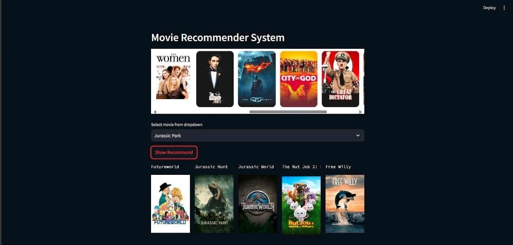
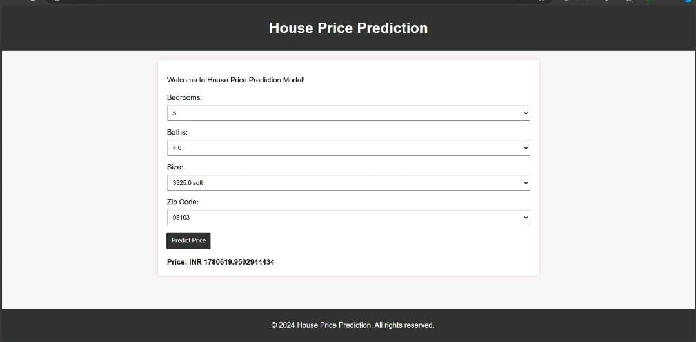

## Movie Recommendation System

### Project Overview:

I developed a Movie Recommendation System that tailors suggestions to individual tastes, making it easier for users to discover films they love.

### Key Features:
Content-Based Filtering: Recommends movies based on favourite genres, actors, and directors.

Collaborative Filtering: Analyzes patterns from similar users to suggest movies.

Hybrid Model: Combines various approaches for even more accurate recommendations.

### Tools & Technologies:
• Python: Scripting and model development
• Pandas & NumPy: Data manipulation
• Scikit-Learn: Building recommendation algorithms
• Streamlit: Deploying the model for user interaction.

## House Price Prediction System

### Project Highlights:

### Model Development: 

Created a robust House Price Prediction model considering essential factors such as:

• Number of bedrooms and bathrooms
• Area in square feet
• Zip code of the location

### Data Preparation: 
Ensured accuracy by meticulously processing and cleaning the dataset.

### Machine Learning: 
Leveraged advanced regression models to predict house prices based on user inputs.

### Deployment: 
The model is live and interactive, deployed using Flask. Users can input their preferences and instantly get an estimated price for their dream home.

### Key Takeaways: 
This project was a fantastic learning journey, from data cleaning to model deployment. I’m thrilled to apply these newly honed skills to future challenges and projects.

### Tools & Technologies:
• Python: Scripting and model development
• Pandas & NumPy: Data manipulation
• Scikit-Learn: Building recommendation algorithms
• Streamlit: Deploying the model for user interaction.

